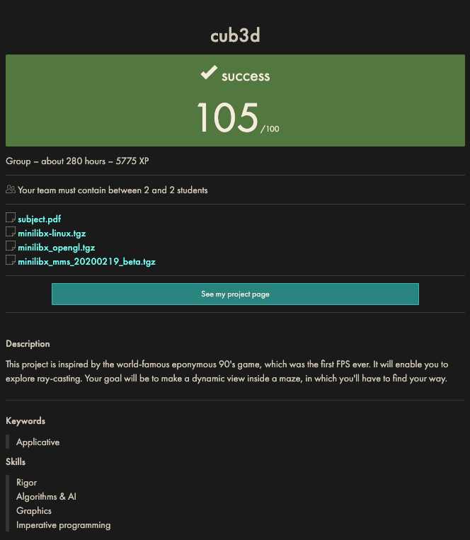

# 42-cub3d



## Installation

Run `make mlx` first to download and untar the mlx library in the correct directory in `cub3d`.

Or manually download [latest mlx library](https://cdn.intra.42.fr/document/document/25855/minilibx-linux.tgz) from 42.fr.

You may need to install various dependencies:

Install X11 Library

``` bash
sudo apt update
sudo apt upgrade
sudo apt install xorg
```

Verify installation

```bash
X -version
```

Install X11 Development Packages

```bash
sudo apt install libx11-dev
sudo apt install libx11-dev libxext-dev libxrandr-dev libxrender-dev libxi-dev
```

## Parsing

Parsing is a bit more complicated than the parsing in `so_long` (the 2D game from 42's rank 02) due to the increased criteria the subject specifies.

Map files must have the extension `.cub`.

They contain:

- Four textures. One for each wall direction.
- Two colours in the decimal RGB format [0-255, 0-255, 0-255]. One for the floor and one for the ceiling.
- A map with the following symbols:
  - `1` represents a wall
  - `0` represents a floor tile
  - `N`, `S`, `W` or `E` represents the players starting position and direction they will be facing.
  - `' '` - spaces can be interepreted differently. We choose for them to represent a void. Some choose to have them represent a floor tile, or a wall.

A basic valid map will look like this:

```.cub
NO textures/NO.xpm
EA textures/EA.xpm
SO textures/SO.xpm
WE textures/WE.xpm

F 0, 0, 55
C 244, 201, 96

11111
10001
10E01
11111
```

Here are some of the parsing rules:

FILE

- Handle non-existent map
- Handle files with incorrect extension
- Handle insufficent permissions
- Handle `map.cub.cub`
- Handle file that is a directory (and/or still ends with `.cub`)
- File is empty

MISCELLANEOUS

- A bad/unsupported char is found
- Map isn't the last element in the file
- Any duplicate elements
- Elements can come in any order
- All elements should be present
- Empty lines or lines with only spaces are valid between each each element.

RGB

- Value is outside 0 - 255 (also check for overflow i.e. `4294967297` would overflow to `1` in an int)
- Contains unsupported char
- A comma must come between each number (also check for 2 consecutive commas)
- Check for leading or trailing commas
- `000000000000000000000001, 255, 255` should parse
- Spaces within numbers should not parse e.g. `25, 1 5, 240`

TEXTURES

- The same tests for the file itself (directory, permissions, non-existent)
- Spaces only or newline after element should not parse
- Handle texture filenames that contain spaces

MAP

- Empty lines within the map section are invalid and should report an error, but empty lines after map we decided were permissiable
- Spaces after the element indicator (`NO`, `F`, etc.) are valid
- Check a single player exists
- All floor tiles must be surrounded by walls. We thought this to mean in all eight directions. But really since clipping through corners is impossible (see collision) only N, E, S, W is necessary.

### Map Parsing Logic

- Trim trailing chars from beyond last usable (non-space) char.
- Calculate lowest index of first usable char in each string (line).
  - Trim leading space of each string to that length.
- Calculate highest index of last usable char in each string.
  - Trim trailing space of each string to that length and fill additional indices with `' '` (space) to create rectangular map of usable data.
- Checking algorithm

We didn't use a flood fill algorithm this time because we were simply checking if every floor tile was surrounded by an acceptable character (`N, S, W, E, 0, 1`). In retrospect, any unreachable floor tiles don't need to be surrounded by walls but due to the ambiguity of the subject and evaluators we chose to keep it less open to debate.

## Implementation

### Ray Casting

#### Angle Theory

#### Pixel by Pixel Algorithm

The simplest algorithm to implement is one that steps one pixel in the direction of the x axis and one in the y axis in the direction of the target. This is extremely ineffecient, especially when distances are large. You can increase the step distance but then the accuracy is reduced.

#### DDA Algorithm

### Improvements

- With the use of the mlx function `get_window_size()` a default window size could be set dependent on the host's screen resolution.

Need to check before fill for invalid chars in case a sentinel char is entered.
Or use `\xFF` as sentinel

[Collisions - Slack](https://42born2code.slack.com/archives/CMX2R5JSW/p1713782362848349)
